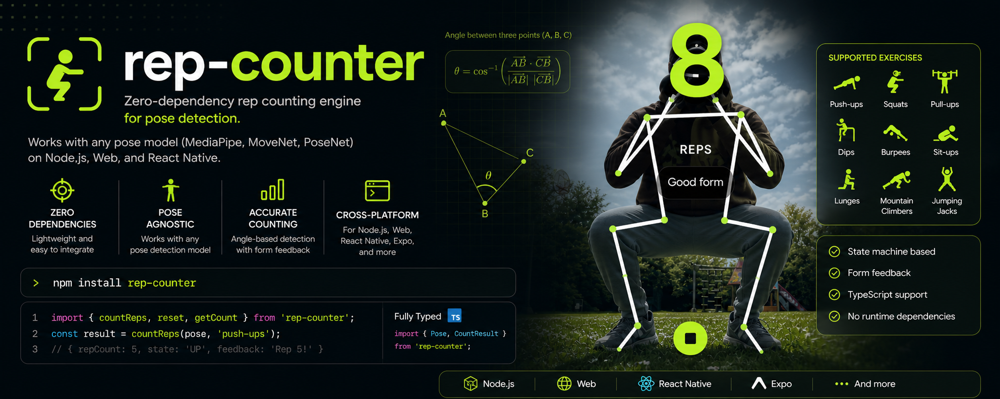

# rep-counter

Zero-dependency rep counting engine for pose detection. Works with any pose model (MediaPipe, MoveNet, PoseNet) on Node.js, web, and React Native.

[Image 1]: assets/rep-counter.png



## Installation

```bash
npm install rep-counter
```

## Usage

```js
import { countReps, reset, getCount } from 'rep-counter';

// Call with each frame from your pose detector
const result = countReps(pose, 'push-ups');
// → { repCount: 5, state: 'UP', feedback: 'Rep 5!' }

// Reset for new set
reset('push-ups');

// Get current count
getCount('push-ups'); // → 0
```

## API

### `countReps(pose, exerciseName)`

Processes a single frame from pose detection and returns rep count.

**Parameters:**
- `pose` — Object with `keypoints` array (from pose detector)
- `exerciseName` — Exercise name string

**Returns:**
```ts
{
  repCount: number;   // Current rep count
  state: string;    // 'WAITING', 'DOWN', 'UP', etc.
  feedback: string; // Form feedback
  angle?: number;   // Calculated angle (debugging)
}
```

### `reset(exerciseName)`

Clears rep count for an exercise to start a new set.

### `getCount(exerciseName)`

Returns current rep count for an exercise.

## Supported Exercises

- Push-ups (and variations: incline, decline)
- Squats (and jump squats)
- Pull-ups / Chin-ups
- Dips
- Burpees
- Sit-ups
- Lunges
- Mountain Climbers
- Jumping Jacks

## Pose Format

Works with any pose detector that outputs keypoints in this format:

```js
const pose = {
  keypoints: [
    { name: 'left_shoulder', x: 0.5, y: 0.3, score: 0.9 },
    { name: 'left_elbow', x: 0.5, y: 0.5, score: 0.9 },
    { name: 'left_wrist', x: 0.5, y: 0.7, score: 0.9 },
    // ... more keypoints
  ]
};
```

Keypoint names follow MediaPipe convention: `left_shoulder`, `right_shoulder`, `left_elbow`, `left_wrist`, `left_hip`, `left_knee`, `left_ankle`, `nose`, etc.

## TypeScript

Fully typed. Import types:

```ts
import { Pose, CountResult } from 'rep-counter';
```

## License

MIT